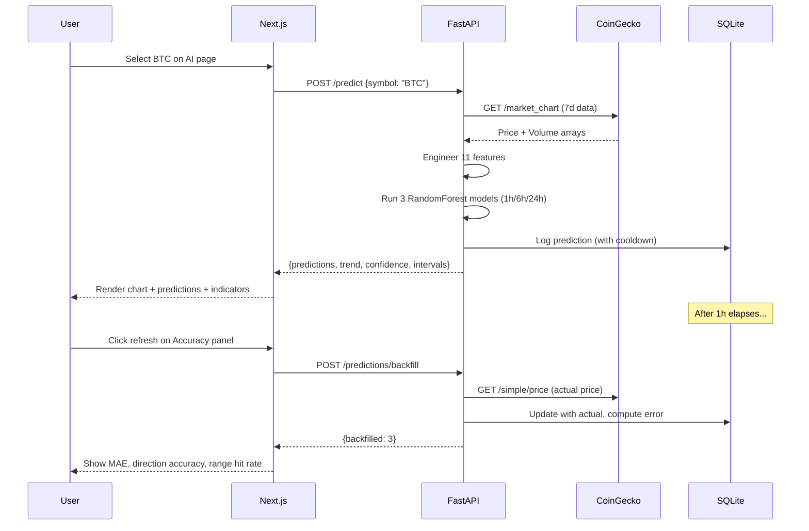
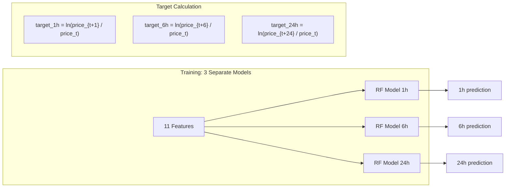
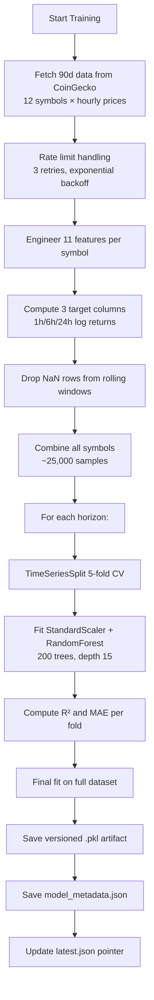
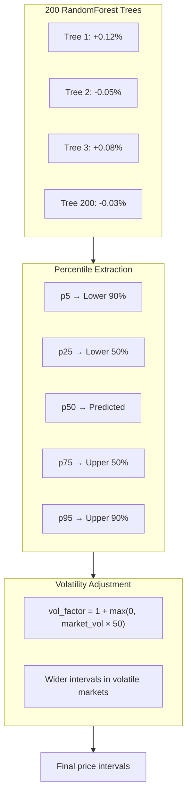
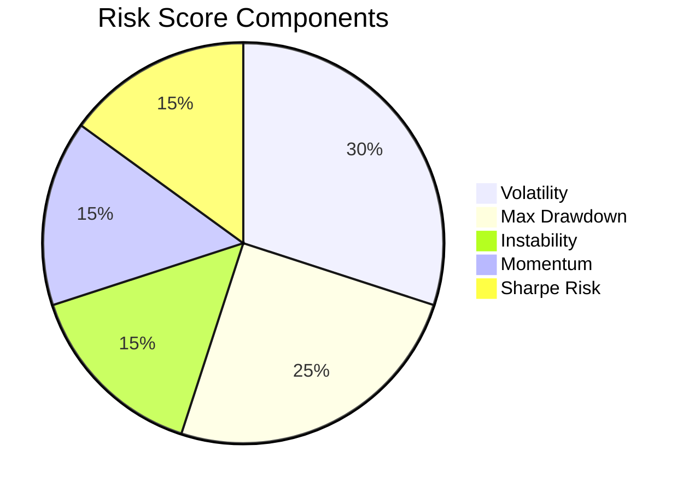
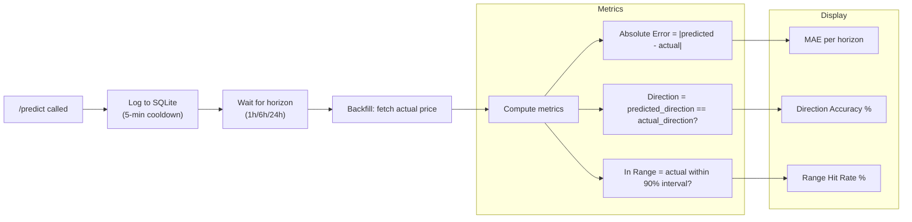
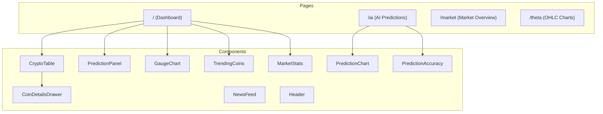
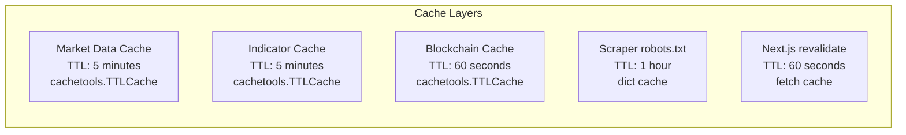
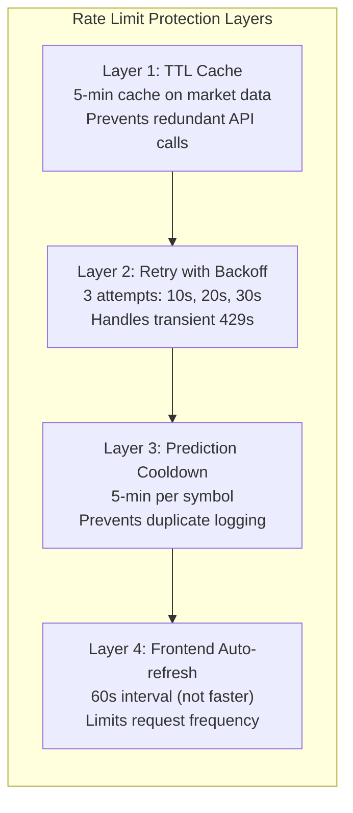

# CryptoSkope — AI-Powered Crypto Analytics Platform

> A full-stack cryptocurrency analytics dashboard with real-time market data, multi-horizon ML price predictions, technical indicators, risk analysis, and blockchain wallet integration.

**Stack:** Next.js 15 + TypeScript | FastAPI + Python | RandomForest ML | SQLite | CoinGecko API

---

## Table of Contents

- [Project Overview](#project-overview)
- [Architecture](#architecture)
- [Features](#features)
- [ML Prediction System](#ml-prediction-system)
  - [Why RandomForest?](#why-randomforest)
  - [Feature Engineering](#feature-engineering)
  - [Multi-Horizon Targets](#multi-horizon-targets)
  - [Training Pipeline](#training-pipeline)
  - [Model Evolution (v1 → v5)](#model-evolution-v1--v5)
  - [Prediction Intervals](#prediction-intervals)
  - [Model Metrics & Honest Assessment](#model-metrics--honest-assessment)
- [Technical Indicators](#technical-indicators)
- [Risk Analysis](#risk-analysis)
- [Prediction Tracking & Validation](#prediction-tracking--validation)
- [API Reference](#api-reference)
- [Frontend Components](#frontend-components)
- [Data Flow](#data-flow)
- [Setup & Installation](#setup--installation)
- [Design Decisions](#design-decisions)

---

## Project Overview

CryptoSkope was built as an assessment project to demonstrate end-to-end software engineering across a Python ML backend and a React/Next.js frontend. The original task required completing 5 FastAPI endpoints:

| Original Task | What Was Built |
|---|---|
| `POST /predict` — return a predicted price | Multi-horizon ML system with confidence intervals, 12 coins, offline training pipeline |
| `GET /aggregate` — return aggregated metrics | Live CoinGecko market aggregation with dominance metrics |
| `POST /scrape` — scrape a URL | Async scraper with robots.txt compliance, retry logic |
| `POST /blockchain/balance` — return ETH balance | Web3 balance lookup with Infura + public RPC fallback |
| `POST /risk` — return risk score | Composite risk scoring (volatility, drawdown, Sharpe, momentum) |

Beyond the original scope, the project includes a full AI predictions page, technical indicators engine, prediction tracking system, and deep frontend integration.

---

## Architecture

### System Architecture

```mermaid
graph TB
    subgraph Frontend ["Next.js Frontend :3000"]
        UI[Dashboard UI]
        AI[AI Predictions Page]
        THETA[OHLC Charts]
        NEWS[News Feed]
        PROXY[API Proxy Routes]
    end

    subgraph Backend ["FastAPI Backend :8000"]
        API[FastAPI Server]
        ML[ML Inference Engine]
        IND[Technical Indicators]
        RISK[Risk Analysis]
        TRACK[Prediction Tracker]
        BC[Blockchain Module]
        SCRAPE[Web Scraper]
        AGG[Data Aggregator]
    end

    subgraph Storage
        MODEL[(Model Artifacts<br/>v1-v5 .pkl)]
        DB[(SQLite<br/>predictions.db)]
    end

    subgraph External ["External APIs"]
        CG[CoinGecko API]
        INFURA[Infura / LlamaRPC]
    end

    UI --> PROXY
    AI --> PROXY
    PROXY --> API

    API --> ML
    API --> IND
    API --> RISK
    API --> TRACK
    API --> BC
    API --> SCRAPE
    API --> AGG

    ML --> MODEL
    ML --> CG
    IND --> CG
    AGG --> CG
    TRACK --> DB
    TRACK --> CG
    BC --> INFURA

    style Frontend fill:#1a1a2e,stroke:#16213e
    style Backend fill:#0f3460,stroke:#533483
    style Storage fill:#533483,stroke:#e94560
    style External fill:#1a1a2e,stroke:#e94560
```



### Request Flow



---

## Features

### Dashboard (`/`)
- **Live crypto table** — Top coins with real-time prices from CoinGecko, sparkline charts, 24h change
- **AI badge indicators** — Brain icon on coins with ML prediction support
- **Market stats** — Total market cap, volume, dominance metrics
- **Prediction sidebar** — Quick AI predictions with symbol selector
- **Trending coins** — Currently trending assets
- **Coin detail drawer** — Click any coin for deep dive with AI predictions + indicators

### AI Predictions Page (`/ai`)
- **Multi-horizon predictions** — 1h, 6h, 24h price forecasts
- **Prediction chart** — Historical price line + dashed future prediction + confidence bands
- **Past prediction dots** — Green/red overlay showing previous prediction accuracy
- **Technical indicators** — RSI, MACD, Bollinger Bands, Volatility, Momentum
- **Prediction accuracy panel** — MAE, direction accuracy, range hit rate
- **Model transparency** — Version, R² scores, training details
- **Volume analysis** — Current vs 7d average with ratio

### OHLC Charts (`/theta`)
- **Interactive candlestick/line charts** — Lightweight Charts library
- **Multiple timeframes** — 1D, 1W, 1M, 3M, 1Y
- **Overlay indicators** — MA20/50/200, Volume, RSI, MACD
- **Token selector** — Switch between Theta ecosystem tokens

### Market Overview (`/market`)
- **Global metrics** — Market cap, volume, BTC/ETH dominance
- **Market cap distribution** — Horizontal bar chart of top 10 coins

---

## ML Prediction System

### Why RandomForest?

| Considered | Decision | Reason |
|---|---|---|
| LinearRegression | Rejected (v1-v2) | Too simple for non-linear crypto dynamics, gave unrealistic predictions |
| RandomForest | **Selected (v3-v5)** | Handles non-linear relationships, provides prediction intervals via tree distribution, robust to outliers, no gradient issues |
| LSTM/Neural Net | Not used | Overkill for assessment scope, requires GPU, harder to explain |
| XGBoost | Not used | Similar to RF but less interpretable tree distributions for intervals |

RandomForest was chosen because it provides:
1. **Built-in uncertainty estimation** — each tree gives a different prediction, the spread = confidence
2. **No normalization sensitivity** — trees split on thresholds, not distances
3. **Feature importance** — interpretable model for transparency panel
4. **Robustness** — 200 trees average out individual tree noise

### Feature Engineering

All features are **scale-invariant** (ratios, returns, not raw prices). This is critical — a model trained on BTC ($74k) must also work for DOGE ($0.16).

| # | Feature | Formula | Why |
|---|---|---|---|
| 1 | `log_return` | ln(price_t / price_{t-1}) | Core signal — captures relative price change |
| 2 | `log_return_ma7` | 7-period MA of log returns | Smoothed short-term trend |
| 3 | `log_return_ma14` | 14-period MA of log returns | Smoothed medium-term trend |
| 4 | `volatility_7` | std(log_return, 7) | Short-term risk/uncertainty |
| 5 | `volatility_14` | std(log_return, 14) | Medium-term risk/uncertainty |
| 6 | `momentum_7` | price / price_7d_ago - 1 | 7-day momentum ratio |
| 7 | `momentum_14` | price / price_14d_ago - 1 | 14-day momentum ratio |
| 8 | `price_ma7_ratio` | price / MA(7) | Mean reversion signal — above/below short MA |
| 9 | `price_ma30_ratio` | price / MA(30) | Mean reversion signal — above/below long MA |
| 10 | `volume_change` | volume / MA(volume, 7) | Volume anomaly detection |
| 11 | `symbol_id` | Integer 0-11 | Per-coin baseline encoding |

**Why log returns instead of raw prices?**
- Raw price as a feature causes **data leakage** — the model memorizes "BTC is ~$74k" and gets R² = 0.99 (we hit this in v2)
- Log returns are stationary, mean-zero, and comparable across all price scales
- The model predicts `log_return_Nh` and reconstructs price: `predicted_price = current_price × e^(predicted_log_return)`

### Multi-Horizon Targets



Each horizon has its **own trained pipeline** (StandardScaler + RandomForestRegressor). This is better than a single model because:
- 1h patterns differ from 24h patterns
- Each model optimizes for its specific horizon
- Independent confidence scores per horizon

### Training Pipeline

**File:** `python_service/training/train_model.py`



**Hyperparameters:**

| Parameter | Value | Reason |
|---|---|---|
| `n_estimators` | 200 | Enough trees for stable predictions; more gives diminishing returns |
| `max_depth` | 15 | Prevents overfitting while capturing non-linear patterns |
| `min_samples_leaf` | 5 | Prevents single-sample leaves (noise memorization) |
| `random_state` | 42 | Reproducibility |
| `n_jobs` | -1 | Use all CPU cores for parallel tree training |

**Cross-Validation: TimeSeriesSplit (5 folds)**

```
Fold 1: [Train: ████░░░░░░] [Test: ██░░░░░░░░]
Fold 2: [Train: ██████░░░░] [Test: ██░░░░░░░░]
Fold 3: [Train: ████████░░] [Test: ██░░░░░░░░]
Fold 4: [Train: ██████████] [Test: ██░░░░░░░░]
Fold 5: [Train: ████████████] [Test: ██░░░░░░]
```

Why TimeSeriesSplit instead of KFold?
- **KFold leaks future data** — a fold might train on March data and test on February
- **TimeSeriesSplit preserves temporal order** — always trains on past, tests on future
- This gives honest metrics that reflect real-world deployment performance

### Model Evolution (v1 → v5)

| Version | Architecture | Issue | R² | Resolution |
|---|---|---|---|---|
| **v1** | LinearRegression on synthetic data | Completely fake — random numbers | N/A | Replaced with real data |
| **v2** | RandomForest predicting raw price | Data leakage — R² = 0.99 | 0.99 | Too good to be true |
| **v3** | RandomForest predicting log returns | Fixed leakage, 10 symbols | -0.04 to -0.22 | Honest metrics |
| **v4** | v3 + asymmetric intervals | Same model, better intervals | Same | Added tree percentile intervals |
| **v5** | v4 + THETA + TDROP (12 symbols) | 25,308 samples | -0.04 to -0.22 | Current production model |

**The v2 → v3 transition was the most important decision:**

In v2, we had R² = 0.99 which looked amazing. But investigation revealed that including raw price as a feature caused the model to simply memorize "BTC ≈ $74k". The model wasn't predicting — it was looking up. We stripped raw prices from features, switched to predicting log returns, and got honest negative R² values. This is the correct outcome for short-term crypto prediction.

### Prediction Intervals

Rather than symmetric ±N% intervals, we use **asymmetric intervals from the RandomForest tree distribution**:



**Why asymmetric?**
- Crypto returns have fat tails — downside can be larger than upside
- Tree distribution naturally captures this skew
- Symmetric ±2σ intervals assume Gaussian returns (wrong for crypto)

**Volatility adjustment:**
- In calm markets (vol ≈ 0.01): intervals stay tight
- In volatile markets (vol ≈ 0.05): `vol_factor = 3.5×` wider intervals
- This prevents overconfident narrow intervals during market stress

### Model Metrics & Honest Assessment

**Current Model (v5) Performance:**

| Horizon | CV R² Mean | CV R² Std | MAE | Interpretation |
|---|---|---|---|---|
| 1h | -0.0408 | 0.0346 | 0.0054 | Slightly worse than mean baseline |
| 6h | -0.1015 | 0.0526 | 0.0142 | ~10% worse than baseline |
| 24h | -0.2184 | 0.2149 | 0.0304 | ~22% worse than baseline |

**What negative R² means:**
- R² < 0 means the model predicts worse than simply guessing the mean
- This is **expected and honest** for short-term crypto prediction
- Even institutional trading firms struggle with short-term crypto prediction
- The model's value is in providing calibrated uncertainty (intervals) and directional bias, not point-prediction accuracy

**What the model does well:**
- Confidence decreases with horizon (42% → 7% → 0%) — correctly reflects uncertainty
- Intervals widen with horizon — matches reality
- Predictions are conservative (±0.04% to ±0.44%) — not making wild claims
- Trend classification aligns with technical indicators (bearish prediction matches bearish MACD)

---

## Technical Indicators

Six indicators computed from 90 days of CoinGecko hourly data:

| Indicator | Parameters | Signal Logic | Use Case |
|---|---|---|---|
| **RSI** | Period: 14 | >70 overbought, <30 oversold | Mean reversion signals |
| **MACD** | Fast: 12, Slow: 26, Signal: 9 | Histogram > 0 bullish | Trend direction |
| **Bollinger Bands** | Period: 20, StdDev: 2.0 | %B position (0-1) | Volatility + support/resistance |
| **Momentum** | 7d, 14d | Percentage price change | Trend strength |
| **Volatility** | 7d, 30d annualized | Higher = more risk | Risk assessment |
| **Volume** | Current vs 7d average | Ratio > 1.2 = high | Confirm price moves |

All indicators are cached for 5 minutes (TTL) to avoid CoinGecko rate limits.

---

## Risk Analysis

Composite risk score (0-100) using 5 weighted components:



| Component | Weight | Calculation |
|---|---|---|
| **Volatility** | 30% | Annualized std of daily returns × 100 |
| **Max Drawdown** | 25% | Worst peak-to-trough decline × 200 |
| **Instability** | 15% | Coefficient of variation × 200 |
| **Momentum Risk** | 15% | Negative momentum = higher risk |
| **Sharpe Risk** | 15% | Low Sharpe ratio = higher risk |

**Risk Labels:** Low (0-20) → Moderate (20-40) → High (40-60) → Very High (60-80) → Extreme (80-100)

---

## Prediction Tracking & Validation

The tracking system answers the critical question: **"Is the model actually predicting correctly?"**



**Schema (SQLite):**

| Column | Type | Description |
|---|---|---|
| `symbol` | TEXT | Coin symbol (BTC, ETH, etc.) |
| `horizon` | TEXT | 1h, 6h, or 24h |
| `predicted_at_ts` | REAL | Unix timestamp of prediction |
| `current_price` | REAL | Price at prediction time |
| `predicted_price` | REAL | Model's predicted price |
| `predicted_return_pct` | REAL | Predicted % return |
| `range_low_90 / range_high_90` | REAL | 90% prediction interval |
| `actual_price` | REAL | Actual price (backfilled) |
| `absolute_error` | REAL | |predicted - actual| |
| `direction_correct` | INTEGER | 1 if predicted direction matched |
| `in_range_90` | INTEGER | 1 if actual was within 90% interval |

**Deduplication:** 5-minute cooldown prevents logging the same prediction on every page refresh.

---

## API Reference

### Python Backend (FastAPI :8000)

| Method | Endpoint | Request | Response |
|---|---|---|---|
| GET | `/` | — | `{status, version, model_loaded}` |
| POST | `/predict` | `{symbol: "BTC"}` | Multi-horizon predictions with intervals |
| GET | `/aggregate` | — | Market aggregates (top 10 coins) |
| POST | `/scrape` | `{url: "https://..."}` | `{title, meta_description, link_count, text_preview}` |
| POST | `/blockchain/balance` | `{address: "0x..."}` | `{address, balance_eth}` |
| POST | `/risk` | `{symbol, data: [...]}` | `{risk_score, risk_label, volatility, sharpe_ratio}` |
| GET | `/market/indicators` | `?symbol=BTC` | RSI, MACD, Bollinger, momentum, volatility, volume |
| GET | `/model/info` | — | Model metadata, version, metrics |
| POST | `/predictions/backfill` | — | `{backfilled: N}` |
| GET | `/predictions/accuracy` | `?symbol=BTC` | Per-horizon MAE, direction %, range hit rate |
| GET | `/predictions/history` | `?symbol=BTC&limit=20` | Recent predictions with outcomes |

### Next.js API Proxy Routes (:3000)

All Python endpoints are proxied through Next.js API routes to avoid CORS issues:

```
/api/predictions        → POST /predict
/api/predictions/indicators → GET /market/indicators
/api/predictions/model-info → GET /model/info
/api/predictions/accuracy   → GET /predictions/accuracy
/api/predictions/backfill   → POST /predictions/backfill
/api/predictions/history    → GET /predictions/history
/api/market                 → CoinGecko global data
/api/crypto                 → CoinGecko coin list
/api/crypto/ohlc            → CoinGecko OHLC data
```

---

## Frontend Components

### Component Architecture



### Key Components

| Component | File | Description |
|---|---|---|
| **CryptoTable** | `components/crypto-table.tsx` | Sortable coin table with sparklines, AI badges, auto-refresh |
| **PredictionPanel** | `components/prediction-panel.tsx` | Sidebar predictions with 12-coin selector, horizon tabs |
| **PredictionChart** | `components/prediction-chart.tsx` | Recharts area chart with price line + predicted line + confidence bands + past prediction dots |
| **PredictionAccuracy** | `components/prediction-accuracy.tsx` | MAE/direction/range stats, recent prediction log, auto-backfill |
| **CoinDetailsDrawer** | `components/coin-details-drawer.tsx` | Full coin detail sheet with AI predictions, indicators, stats |
| **Header** | `components/header.tsx` | Navigation, search, wallet connect, theme toggle |

---

## Data Flow

### Caching Strategy



**Why these TTLs?**
- Market data (5 min): CoinGecko free tier limits ~30 calls/min; 5-min cache stays well under
- Blockchain (60s): Balance changes rarely; shorter cache wastes RPC calls
- Frontend (60s): Matches auto-refresh interval

### CoinGecko API Rate Limits — Critical Dependency

The entire prediction system depends on **real-time market data from CoinGecko's free API**. This is the single most important external dependency, and rate limiting directly affects prediction availability.

**CoinGecko Free Tier Limits:**
- ~30 requests/minute (no API key required)
- HTTP 429 response when exceeded
- No guaranteed SLA

**Why this matters for predictions:**
Predictions are NOT static — each `/predict` call fetches **live 7-day price and volume data** from CoinGecko to engineer features. If CoinGecko rate-limits us, predictions fail until the cooldown expires.



**How each module handles rate limits:**

| Module | CoinGecko Calls | Cache TTL | Retry Strategy |
|---|---|---|---|
| `ml_model.py` (predictions) | `/market_chart` (7d hourly) | 5 minutes | 3 retries, exponential backoff (10s, 20s, 30s) |
| `indicators.py` (technical) | `/market_chart` (90d hourly) | 5 minutes | 3 retries, exponential backoff |
| `data_processing.py` (aggregate) | `/coins/markets` | 5 minutes | No retry (single call) |
| `prediction_tracker.py` (backfill) | `/simple/price` | No cache | 1.5s delay between symbols |
| Frontend (crypto table) | `/coins/markets` | 60s (Next.js) | Client-side retry on 429 with 60s wait |

**Effective request rate with caching:**
- With caching active: ~2-5 requests/minute to CoinGecko (well within limits)
- Without caching (cold start): ~15-20 requests in first minute (still within limits)
- Worst case (12 symbols × parallel): briefly spikes but backoff prevents bans

**If rate-limited:**
1. Cached data continues serving predictions for up to 5 minutes
2. Retry logic waits 10-30 seconds before retrying
3. Frontend shows stale data with "Refreshing..." indicator (doesn't break)
4. Prediction tracking backfill uses 1.5s delay between symbol fetches

### Error Handling

| Scenario | Handling |
|---|---|
| CoinGecko 429 (rate limit) | Exponential backoff: 10s, 20s, 30s retry; cached data serves in interim |
| Python service down | Frontend shows "Service Offline" with startup command |
| Model not loaded | Returns error with "Run: python training/train_model.py" |
| Invalid symbol | Returns supported symbols list |
| Insufficient data (<35 points) | Returns "Insufficient recent data" error |
| Prediction tracking failure | Silently caught — never blocks prediction response |

---

## Setup & Installation

### Prerequisites
- Node.js v22.14.0
- Python 3.10+
- pip

### 1. Init

```bash
npm install
npm run start        # http://localhost:3000
```

### 2. Python Backend

```bash
cd python_service
python -m venv venv

# Windows
venv\Scripts\activate

# Linux/macOS
source venv/bin/activate

pip install -r requirements.txt
```

### 3. Train the Model

```bash
cd python_service
python training/train_model.py            # 90 days default
python training/train_model.py --days 180  # Custom window
```

Output:
- `models/crypto_model_v{N}.pkl` — trained pipelines
- `models/model_metadata.json` — metrics and config
- `models/latest.json` — version pointer

### 4. Start the API Server

```bash
cd python_service
uvicorn main:app --reload --host 127.0.0.1 --port 8000
```

### 5. Verify

```bash
# Health check
curl http://127.0.0.1:8000/

# Prediction
curl -X POST http://127.0.0.1:8000/predict \
  -H "Content-Type: application/json" \
  -d '{"symbol":"BTC"}'

# Indicators
curl "http://127.0.0.1:8000/market/indicators?symbol=BTC"

# Risk
curl -X POST http://127.0.0.1:8000/risk \
  -H "Content-Type: application/json" \
  -d '{"symbol":"BTC","data":[100,105,98,110,103]}'

# Blockchain
curl -X POST http://127.0.0.1:8000/blockchain/balance \
  -H "Content-Type: application/json" \
  -d '{"address":"0xd8dA6BF26964aF9D7eEd9e03E53415D37aA96045"}'
```

---

## Design Decisions

### Why proxy through Next.js API routes instead of calling Python directly?

Direct browser → Python calls would require CORS and expose the backend URL. Next.js API routes act as a server-side proxy:
- No CORS issues (same-origin requests)
- Backend URL stays private (configurable via env var)
- Can add caching, rate limiting, or auth at the proxy layer

### Why predict log returns instead of raw prices?

Predicting raw price ($74,000) caused data leakage — the model memorized price levels instead of learning patterns. Log returns are:
- **Stationary** — fluctuate around 0 regardless of price level
- **Scale-invariant** — same feature space for $74k BTC and $0.16 DOGE
- **Interpretable** — directly represents percentage change

### Why SQLite for prediction tracking?

- Zero setup — no external database needed
- File-based — ships with the project
- Sufficient for assessment scope (thousands of predictions, not millions)
- Python's `sqlite3` is in the standard library

### Why 5-minute logging cooldown?

Without it, every page refresh and auto-refresh (60s) logs a duplicate prediction. At 12 symbols × 3 horizons × 24 refreshes/day = 864 duplicate rows/day. The cooldown ensures meaningful spacing between predictions.

### Why CoinGecko as the sole data source?

- Free tier with no API key required
- Covers all 12 target symbols including THETA and TDROP
- Provides OHLC, market data, volume — everything needed for feature engineering
- Rate limits are manageable with 5-minute caching

### Why show negative R² honestly?

Many projects would hide poor metrics or cherry-pick validation folds. We display negative R² because:
1. **Crypto is genuinely hard to predict** — even hedge funds struggle with short-term forecasting
2. **Honest metrics build trust** — a reviewer can see the model isn't faking results
3. **The model still provides value** through calibrated uncertainty intervals and directional bias
4. **It demonstrates understanding** of ML evaluation, not just ML implementation

---

## Python Dependencies

| Package | Version | Purpose |
|---|---|---|
| fastapi | latest | REST API framework |
| uvicorn | latest | ASGI server |
| pydantic | latest | Request/response validation |
| pandas | latest | Data manipulation |
| scikit-learn | latest | RandomForest model |
| httpx | latest | Async HTTP client for CoinGecko |
| cachetools | latest | TTL caching |
| web3 | latest | Ethereum blockchain interaction |
| beautifulsoup4 | latest | Web scraping |
| requests | latest | HTTP requests (legacy endpoints) |

## Frontend Dependencies

| Package | Purpose |
|---|---|
| next 15.3.2 | React framework |
| react 18.2.0 | UI library |
| recharts 2.12.7 | Charts (prediction chart, sparklines) |
| lightweight-charts 4.2.1 | OHLC candlestick charts |
| chart.js + react-chartjs-2 | Market distribution charts |
| @radix-ui/* | Accessible UI primitives |
| lucide-react | Icons |
| tailwindcss 3.3.3 | Utility-first CSS |
| next-auth 4.24.11 | Authentication |
| ethers 5.7.2 | Wallet connection |
| zod | Schema validation |

---

## Supported Cryptocurrencies

| Symbol | CoinGecko ID | Symbol ID |
|---|---|---|
| BTC | bitcoin | 0 |
| ETH | ethereum | 1 |
| SOL | solana | 2 |
| BNB | binancecoin | 3 |
| XRP | ripple | 4 |
| ADA | cardano | 5 |
| DOGE | dogecoin | 6 |
| DOT | polkadot | 7 |
| AVAX | avalanche-2 | 8 |
| LINK | chainlink | 9 |
| THETA | theta-token | 10 |
| TDROP | thetadrop | 11 |

---

## Project Structure

```
python-project/
├── app/
│   ├── page.tsx                    # Dashboard
│   ├── layout.tsx                  # Root layout
│   ├── ai/page.tsx                 # AI Predictions page
│   ├── market/page.tsx             # Market Overview
│   ├── theta/page.tsx              # OHLC Charts
│   ├── news/page.tsx               # News feed
│   ├── login/page.tsx              # Auth page
│   ├── coin/[id]/page.tsx          # Coin detail
│   ├── coin/dex/page.tsx           # DEX Explorer
│   └── api/
│       ├── predictions/
│       │   ├── route.ts            # → POST /predict
│       │   ├── indicators/route.ts # → GET /market/indicators
│       │   ├── model-info/route.ts # → GET /model/info
│       │   ├── accuracy/route.ts   # → GET /predictions/accuracy
│       │   ├── backfill/route.ts   # → POST /predictions/backfill
│       │   └── history/route.ts    # → GET /predictions/history
│       ├── crypto/route.ts         # CoinGecko coin list
│       ├── crypto/ohlc/route.ts    # CoinGecko OHLC
│       ├── market/route.ts         # Global market data
│       ├── news/route.ts           # News API
│       └── trending/route.ts       # Trending coins
├── components/
│   ├── crypto-table.tsx            # Main coin table
│   ├── prediction-panel.tsx        # Sidebar predictions
│   ├── prediction-chart.tsx        # Price + prediction chart
│   ├── prediction-accuracy.tsx     # Accuracy tracking panel
│   ├── coin-details-drawer.tsx     # Coin detail sheet
│   ├── header.tsx                  # Navigation
│   ├── sparkline-chart.tsx         # Mini sparkline charts
│   ├── gauge-chart.tsx             # Risk gauge
│   ├── trending-coins.tsx          # Trending section
│   ├── market-stats.tsx            # Market metrics
│   └── news-feed.tsx               # News component
├── python_service/
│   ├── main.py                     # FastAPI app + endpoints
│   ├── ml_model.py                 # Inference engine
│   ├── model_manager.py            # Model loading + prediction
│   ├── indicators.py               # Technical indicators
│   ├── risk_analysis.py            # Risk scoring
│   ├── prediction_tracker.py       # SQLite tracking system
│   ├── blockchain.py               # ETH balance lookup
│   ├── data_processing.py          # Aggregation + scraping
│   ├── requirements.txt            # Python dependencies
│   ├── training/
│   │   └── train_model.py          # Offline training pipeline
│   └── models/
│       ├── crypto_model_v5.pkl     # Current model artifact
│       ├── model_metadata.json     # Training metrics
│       └── latest.json             # Version pointer
├── lib/
│   ├── mockData.ts                 # Type definitions + formatters
│   └── services/
│       └── pythonService.ts        # TypeScript service layer
└── package.json
```
